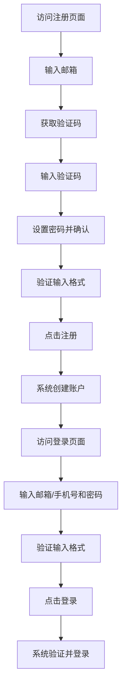

## 1. Product Overview
登录/注册系统是一个用户身份认证模块，用于管理用户账户的创建和访问。
- 主要功能包括用户注册、登录，以及相关的表单验证和交互体验。
- 目标用户为需要访问系统的所有用户，提供安全便捷的身份认证服务。

## 2. Core Features

### 2.1 User Roles
| Role | Registration Method | Core Permissions |
|------|---------------------|------------------|
| Normal User | Email/Phone registration | Access system features after login |

### 2.2 Feature Module
1. **登录页面**：邮箱/手机号输入、密码输入、登录按钮、跳转到注册页面
2. **注册页面**：邮箱输入、邮箱验证码、密码设置、确认密码、注册按钮、跳转到登录页面

### 2.3 Page Details
| Page Name | Module Name | Feature description |
|-----------|-------------|---------------------|
| 登录页面 | 登录表单 | 支持邮箱/手机号输入、密码输入、表单验证、登录按钮、跳转到注册页面链接 |
| 注册页面 | 注册表单 | 支持邮箱输入、验证码获取（60秒倒计时）、密码设置、确认密码、表单验证、注册按钮、跳转到登录页面链接 |

## 3. Core Process
用户登录流程：
1. 用户访问登录页面
2. 输入邮箱/手机号和密码
3. 系统验证输入格式
4. 点击登录按钮提交表单
5. 系统验证凭证并登录

用户注册流程：
1. 用户访问注册页面
2. 输入邮箱
3. 点击获取验证码按钮（触发60秒倒计时）
4. 输入收到的验证码
5. 设置密码并确认
6. 系统验证输入格式
7. 点击注册按钮提交表单
8. 系统创建账户并跳转到登录页面

## 4. User Interface Design
### 4.1 Design Style
- 主色调：#4F46E5（靛蓝色）
- 辅助色：#EC4899（粉色）
- 按钮样式：圆角矩形，有悬停效果
- 字体：Inter，大小适中
- 布局风格：居中卡片式设计，有合理间距和圆角
- 背景：渐变色背景，从#F3F4F6到#E5E7EB

### 4.2 Page Design Overview
| Page Name | Module Name | UI Elements |
|-----------|-------------|-------------|
| 登录页面 | 登录表单 | 居中卡片，白色背景，阴影效果，圆角边框，表单元素有适当间距，输入框有焦点效果，按钮有悬停动画 |
| 注册页面 | 注册表单 | 与登录页面类似，增加验证码输入框和获取验证码按钮，按钮有倒计时功能 |

### 4.3 Responsiveness
- 桌面优先设计，适配不同屏幕尺寸
- 移动端自适应，确保在小屏幕上表单元素正确显示
- 触摸优化，按钮尺寸适合触摸操作

### 4.4 3D Scene Guidance
- 无3D场景需求