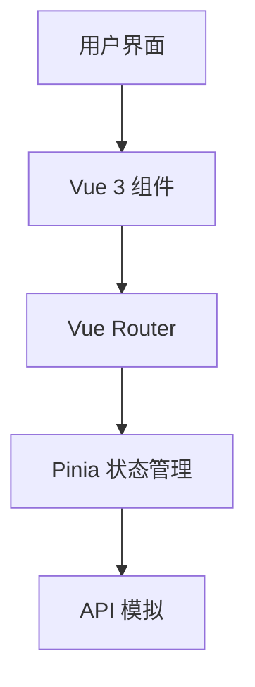

## 1. Architecture Design

## 2. Technology Description
- Frontend: Vue 3 + Vue Router + Pinia + Tailwind CSS
- Initialization Tool: Vite
- Backend: 模拟 API（使用 setTimeout 模拟）
- Database: 无（使用前端状态模拟）

## 3. Route Definitions
| Route | Purpose |
|-------|---------|
| /login | 登录页面 |
| /register | 注册页面 |
| / | 登录后的首页（重定向） |

## 4. API Definitions
### 4.1 模拟 API 接口
| API | Method | Request | Response |
|-----|--------|---------|----------|
| /api/auth/login | POST | { email: string, password: string } | { success: boolean, token: string } |
| /api/auth/register | POST | { email: string, code: string, password: string } | { success: boolean } |
| /api/auth/send-code | POST | { email: string } | { success: boolean } |

## 5. Server Architecture Diagram
- 无后端服务器，使用前端模拟

## 6. Data Model
### 6.1 Data Model Definition
- 无数据库，使用前端状态管理

### 6.2 Data Definition Language
- 无数据库表结构